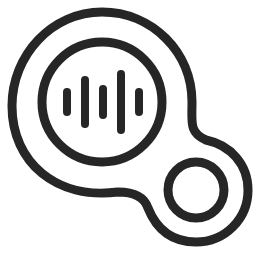
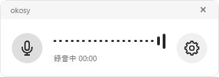

# Gourdy

読み方：ごーでぃ

**日本語を、話したそばから文字に。**

日本語文字起こし · リアルタイム入力 · 完全無料（有料機能なし） · ローカル完結

[導入ガイド](docs/public/getting-started.md) · [開発ガイド](docs/public/development.md) · [設計](docs/public/architecture.md)

Gourdyは、Windowsで使う**音声インターフェイスの日本語IME**を目指すアプリです。
入力欄にカーソルを置いて **右Ctrlを押して離す**。話している途中から文字が入り、認識の変化に合わせて末尾を修正します。
APIキーやクラウド文字起こしサービスの契約は不要です。音声認識・日本語解析・文章補正は端末内で処理します。
初回の開発環境準備と任意モデルのダウンロードにはネット接続が必要です。

> **開発中のソフトウェアです。セキュリティ対策・監査は万全ではありません。**
> 入力先の誤判定、誤認識、データ保存などのリスクが残ります。現時点で機密情報を扱う用途には推奨しません。
> [セキュリティとデータの扱い](docs/public/security.md)をご確認ください。

## できること

- 日本語のリアルタイム文字起こし。小さな録音ウィンドウとタスクトレイ常駐。
- 話しながら入力先へ送る方式と、アプリで結果を確認してから貼り付ける方式。
- フィラー・言い直し・句読点をローカルの日本語解析とLLMで補正。
- 用語辞書、読みの登録、辞書ファイルの取り込みとWindows IME形式の出力。
- マイク選択、ノイズ抑制、入力音量に応じたサウンドバー。
- 履歴のコピー・個別削除、録音からの再認識。
- 音声・動画ファイルの文字起こし。最長12時間、再生プレビュー、区間ごとの保存・再試行・再開。
- 任意の追加モデルによる音声コマンド。初期状態ではオフ。

認識精度や速度は音声・PC性能に依存します。句読点や補正が常に正しいとは限りません。
入力先によって対応状況は異なり、すべてのアプリへの入力を保証するものではありません。
会議の話者分離には対応していません。

## ダウンロード

ビルド済みアプリは、[GitHub Releases](https://github.com/aToy0m0/gourdy/releases/tag/v0.7.1) で `gourdy-0.7.1-windows-x64.zip` と `SHA256SUMS.txt` を配布します。
ZIP全体を展開し、`Gourdy.exe` を起動します。PythonやNode.jsの別途インストールは不要です。Microsoft Visual C++ x64ランタイムが必要です（[導入ガイド](docs/public/getting-started.md)）。
0.7.1はプレリリースです。署名はありません。クリーンなWindows環境での導入試験は未実施です。
[導入・使い方](docs/public/getting-started.md) / [配布手順と公開前の確認事項](docs/public/release.md)

## 技術構成

標準の音声認識はMoonshine Small Streaming Japanese、補正はQwen3.5-0.8B（Q4_0）とllama.cppを使います。
依存バージョンはロックファイル・取得マニフェストで固定しています。

## ライセンス

Gourdyの独自コード・独自ドキュメントは [MIT](LICENSE) です。
モデル、推論エンジン、辞書、FFmpeg、Electronなどの第三者コンポーネントには、それぞれのライセンスが適用されます。
MITの表示だけで同梱物全体の条件を置き換えることはできません。
[第三者ライセンス・対応ソースの確認状況](docs/public/THIRD-PARTY-NOTICES.md)を参照してください。
