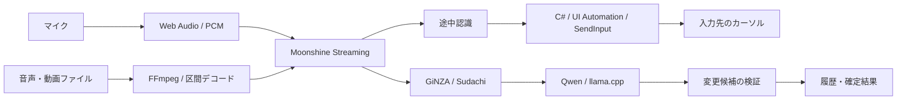

# 設計

## 処理の流れ

Electronメインプロセスが画面、ショートカット、子プロセス、設定保存を管理します。
マイク音声はWeb AudioでPCMへ変換し、PythonワーカーのMoonshineストリーミング認識へ渡します。
小さな録音ウィンドウ、設定、未入力の文字起こしを表示する吹き出し、お知らせ用の吹き出しを分けます。通常の録音画面には状態テキストを常時表示せず、ショートカットはマイクホバー、お知らせは追加の情報ボタンから表示します。

## リアルタイム入力

C#ヘルパーを録音セッション中保持し、Windows UI Automationで入力先の値・選択範囲を確認します。
認識結果の差分をキー入力として送り、変更された末尾をBackspaceで修正します。
自身のSendInputと利用者の操作を区別し、フォーカス移動や手動編集を検出すると自動入力を停止します。
日本語IMEの変換中状態との衝突を避けるため、送信時にIME状態を扱い、処理後に戻します。
UI Automationの公開情報はアプリごとに異なり、入力互換性の検証を継続しています。

## 補正

GiNZA/Sudachiで語・係り受け・文節を解析し、辞書候補や保護すべき数字などを抽出します。
小型LLMは候補の選択・文章補正に使い、変更範囲などをプログラムで検証します。
辞書の読みはひらがなに揃え、カタカナ入力は自動変換します。漢字などの不正な読みは保存時に知らせます。
LLMには原文と、文字から推定した読みを区別して渡します。音声から独立した読みやアクセントを取得しているわけではありません。
録音中補正が有効な場合、原文を即時入力しながら短い区間を順番に補正します。句読点などの明確な候補はプログラムで処理し、辞書候補や曖昧な候補がある時はLLMを使います。
認識が変わった区間の古い補正は破棄し、停止時には残りを処理します。遅延や処理上限に達した場合は通知し、原文を保持します。
辞書は強制変換ルールではなく参考語彙として渡します。短い読みも含め、LLMが原文・読み・前後文脈から選択します。数字を含む言い直しなども原文を残す場合があります。
録音中補正は音声認識と同時に動作し、メモリ使用量が1GBを超える場合があります。設定で無効化すると停止後に補正します。
任意の音声コマンド機能は別モデルのダウンロードを必要とし、初期状態では無効です。

## 長時間ファイル

FFmpegで区間ごとにデコードして処理します。無音付近の境界と短い重なりを使い、境界での単語切れを軽減します。
認識原文を補正前に保存し、区間単位で状態を永続化します。
失敗区間は最大3回試行し、連続失敗時は早期停止します。元ファイルの変更を検出した場合は再開を拒否します。
録音・会議処理・履歴の保存先を分け、長時間処理の結果を通常履歴の文字数制限で切り捨てない構成です。

## ローカル処理と保存

音声認識、日本語解析、LLM推論はローカルです。llama.cppはループバック接続で呼び出します。
セットアップとモデルの取得には外部通信を使います。モデルの待機・解放は処理のライフサイクルに合わせます。
設定と通常履歴はJSONを一時ファイルへ書き、置換して保存します。
暗号化・完全なセキュリティ監査は未対応です。詳細は [セキュリティ](security.md) を参照してください。

## ローカルMCP

設定は独立した「MCP接続」タブに置き、開発中のファイル文字起こし・辞書編集・履歴確認機能として表示します。
`mcp-clients.cjs` が接続先別の設定形式を扱い、JSON/JSONC/TOMLを解析して `gourdy` だけを追加します。
JSONCのコメントとTOMLの既存本文を保持し、追記後を再解析して他の値が変わっていないことを確認します。
既存ファイルのバックアップ、書き込み直前の競合検査、一時ファイルからの置換を行います。対象ごとの失敗を返し、未選択のアプリは変更しません。
実際のユーザー設定への追記は画面のボタン操作時のみ行います。自動テストは隔離フォルダーを使用します。

設定で無効化できるStreamable HTTPサーバーを127.0.0.1で動かします。Bearer認証に加えHost/Originを検査し、ファイル読込画面と同じ会議処理を呼び出します。ジョブ開始は非同期で返し、進捗・途中結果・中断・再開をAPIから扱います。標準ポートは55888で、他プロセスと競合した場合は理由を表示します。

### MCP 2026-07-28対応

公式TypeScript SDK v2の `createMcpHandler` とNodeアダプターを使用します。
新方式は `initialize` とセッションIDを使わず、各リクエストのメタデータとHTTPヘッダーで処理します。
旧方式のリクエストはSDKの `legacy: stateless` に明示的に振り分け、新方式での認証失敗や不正な要求を旧方式で再実行しません。
同じ `/mcp` と既存のBearerトークンを使用するため、接続先設定の変更は不要です。

ファイル文字起こし5ツールに、辞書・表記置換の確認／追加／削除、通常履歴の一覧／詳細、保存録音一覧の9ツールを加えた14ツールを公開します。辞書変更は設定UIと同じ保存キューで直列化し、処理中は拒否します。履歴は概要をページ単位で返し、全文はID指定で取得します。
進捗はジョブIDを指定して取得し、接続を維持する通知購読は受け付けません。
ジョブと区間の保存はアプリケーションの状態であり、MCPセッションには依存しません。
新方式では現在の各ツールはJSONで応答し、旧方式の互換応答はSDKが要求単位のSSEを使う場合があります。
認証は従来のローカルBearer方式を維持し、OAuth認可サーバーは導入していません。

この変更は0.7.4の配布物に含まれます。
参考：[公式SDK移行ガイド](https://github.com/modelcontextprotocol/typescript-sdk/blob/main/docs/migration/support-2026-07-28.md)。

#### 実クライアントの接続確認

2026年9月18日、検証ビルドで6.125秒の日本語音声付きMP4を処理しました。
両クライアントで登録、開始、完了結果の取得、一覧確認まで成功しています。

| クライアント | バージョン | 実測したMCP仕様 |
| --- | --- | --- |
| Claude Code | 2.1.261 | 2026-07-28（新方式） |
| Codex CLI | 0.153.4 | 2025-06-18（旧方式の互換経路） |

受信した通信のバージョンとメソッドで判定しています。
Codex CLIでの成功は、新方式の使用を意味しません。
この試験はCLIからの短い動画処理を対象としており、デスクトップGUIと長時間ファイルの検証は含みません。

## 補正モデルの選択

設定の「操作」→「補正に上位モデルを使う」で切り替えます。初期状態はオフです。

| 設定 | 補正モデル | 配布・取得 |
| --- | --- | --- |
| オフ | Qwen3.5-0.8B Q4_0 | 明示的にダウンロード |
| オン | Qwen3-4B Q4_K_M | 約2.5GBを追加取得。音声キー操作と同じファイルを共用 |

録音停止後の補正、保存録音の再認識、ファイルからの文字起こし（MCP経由を含む）の補正に適用します。
音声認識モデルとリアルタイム入力方式は変わりません。
上位補正と音声キー操作は独立して有効化できます。取得済みの4Bモデルは再ダウンロードしません。
モデルは補正処理時に読み込み、終了時に解放します。標準モデルのファイルは残し、オフに戻せます。
選択中の4Bモデルが欠落・破損した場合はエラーを表示し、標準モデルへ暗黙に切り替えません。

大きいモデルが常に高精度になるわけではありません。補正待ち時間とメモリ使用量が増える可能性があり、1GB以下のメモリ使用量は保証しません。

## 任意のBYOKマイク入力（0.7.4）

Electronメインプロセスが暗号化キーを読み、固定の公式APIエンドポイントへWebSocket接続します。レンダラーへキーは返しません。
マイクPCM16kHzを、OpenAIでは24kHz PCM16へ変換し、Geminiでは16kHz PCM16へ変換します。部分認識は既存の入力先監視・差分キー送信へ接続します。
OpenAIはgpt-live-transcribeのdeltaを逐次反映し、15秒ごとと停止時にcommitします。確定結果はitem_idで対応づけます。Geminiは録音開始/停止をactivityStart/activityEndへ対応させ、interimを上書きし、finalを蓄積します。手動VADにより途中の無音終了通知と録音終了通知の混同を避けます。停止時は最終応答を待ち、20秒の期限を越えたらエラーを明示します。
BYOKの補正はローカルモデルを読み込まず、認識文・前後の文脈・読み付き辞書をLuna / Gemini Flashへ渡します。修正箇所を検査し、重複・曖昧な一致・数字の変更などは拒否します。意味の保存を完全に保証するものではありません。音声コマンドも同じモデルを使い、既存のキー許可リスト・回数上限を守ります。
録音中の補正が無効なら停止時に補正します。ファイル読込・再認識・MCPにも共通の接続先を適用します。
APIのタイムアウト・切断・利用上限は明示し、認識済み原文を保持します。マイク入力の接続は自動再試行しません。ファイル処理の再試行は次節のとおりです。

## 共通AI接続によるファイル処理

AI接続の選択はマイク・ファイル・保存録音の再認識・MCPで共通です。用途別の接続先設定はありません。ファイルはFFmpegで区間ごとに16kHz PCMへ変換し、選択中のローカル認識器またはBYOK音声接続へ送ります。BYOKは100ms分ずつ実時間相当で送信し、同じ提供元のLLMで補正します。ローカルモデルは読み込みません。
原文を補正前に保存し、補正だけ失敗した場合は音声を再送せず再開します。完了区間は再処理せず、未完了区間には再開時の共通接続を使います。認識と補正の提供元を区間ごとに記録します。音声・補正の失敗は区間ごとに最大3回試行し、再送にAPI料金が発生する可能性があります。中断時は接続を閉じます。

## 吹き出しからの手動入力と表示制御

コピー・手動入力は選択範囲があればその範囲を使います。IPCでは選択時の全文と範囲を照合し、認識更新後の古い選択は拒否します。入力済み範囲が不明でも手動入力を許可しますが、元の入力を自動削除しません。通常の手動入力はクリップボード経由で、送信直前に対象ウィンドウと入力欄が変わっていないことを確認します。入力済み境界の修正が必要な既知の続きのみ、従来の検証付き差分入力を使います。
明示的なダブルタップ格納は追加表示の有無にかかわらず実行し、格納中の認識更新で勝手に再表示しません。自動格納は追加表示が閉じられるまで待ちます。
UI Automationが編集できないページ全体を返した場合は入力先として採用せず、約1秒まで入力欄の復帰を観測します。ウィンドウが変わった場合や、入力欄が復帰しない場合は停止し、別の欄へフォーカスを移しません。

## 辞書の自動取り込み除外

取り込み済み語のハッシュを保存し、辞書から削除された語を起動時に自動復活させない仕組みです。取り込み語の表記・読みも保存し、除外一覧からハッシュを個別解除できます。旧形式のハッシュは現在のWindows辞書と照合して表示し、復元できないものは表記不明として扱います。手動取り込みと手動登録にはこの除外を適用しません。
