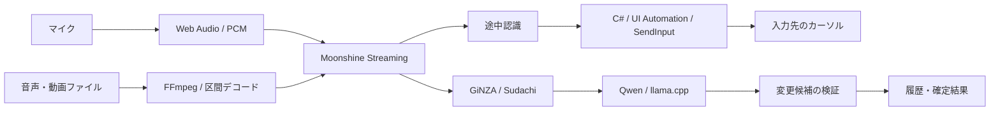

# 設計

## 処理の流れ

Electronメインプロセスが画面、ショートカット、子プロセス、設定保存を管理します。
マイク音声はWeb AudioでPCMへ変換し、PythonワーカーのMoonshineストリーミング認識へ渡します。
小さな録音ウィンドウと設定ウィンドウを分け、録音中の画面占有を抑えます。

## リアルタイム入力

C#ヘルパーを録音セッション中保持し、Windows UI Automationで入力先の値・選択範囲を確認します。
認識結果の差分をキー入力として送り、変更された末尾をBackspaceで修正します。
自身のSendInputと利用者の操作を区別し、フォーカス移動や手動編集を検出すると自動入力を停止します。
日本語IMEの変換中状態との衝突を避けるため、送信時にIME状態を扱い、処理後に戻します。
UI Automationの公開情報はアプリごとに異なり、入力互換性の検証を継続しています。

## 補正

GiNZA/Sudachiで語・係り受け・文節を解析し、辞書候補や保護すべき数字などを抽出します。
小型LLMは候補の選択・文章補正に使い、変更範囲などをプログラムで検証します。
任意の音声コマンド機能は別モデルのダウンロードを必要とし、初期状態では無効です。

## 長時間ファイル

FFmpegで区間ごとにデコードして処理します。無音付近の境界と短い重なりを使い、境界での単語切れを軽減します。
認識原文を補正前に保存し、区間単位で状態を永続化します。
失敗区間は最大3回試行し、連続失敗時は早期停止します。元ファイルの変更を検出した場合は再開を拒否します。
録音・会議処理・履歴の保存先を分け、長時間処理の結果を通常履歴の文字数制限で切り捨てない構成です。

## ローカル処理と保存

音声認識、日本語解析、LLM推論はローカルです。llama.cppはループバック接続で呼び出します。
モデルの取得だけは外部通信します。モデルの待機・解放は処理のライフサイクルに合わせます。
設定と通常履歴はJSONを一時ファイルへ書き、置換して保存します。
暗号化・完全なセキュリティ監査は未対応です。詳細は [セキュリティ](security.md) を参照してください。
